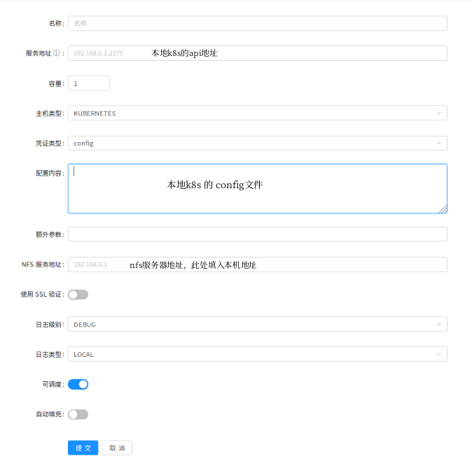
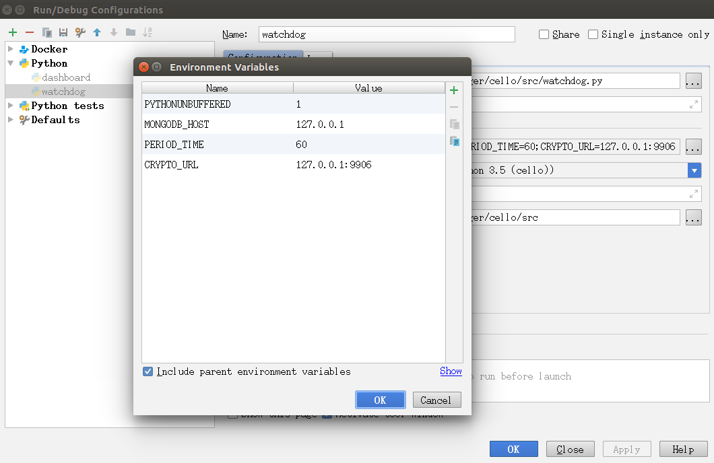

# dashboard开发调试文档

## **前期准备**

### 开发环境

系统：ubunut >= 16.04

+ 安装IDE Pycharm  略
+ 安装docker-ce：略
+ 安装docker-compose: 略
  
### 克隆代码

        git clone http://172.168.160.18/handchainPlatform/cello.git
        cd  $cello

---

## **调试环境**

### 准备minik8s
0. 关闭selinux、开启ipv6

        sudo bash selinux_ipv6.sh

1. 下载kubectl和minikube

&emsp;&emsp; 下载minikube，因为国外的源被墙了，所以只能用阿里的源了
>curl -Lo minikube http://kubernetes.oss-cn-hangzhou.aliyuncs.com/minikube/releases/v0.28.1/minikube-linux-amd64 && chmod +x minikube && sudo mv minikube /usr/local/bin/

&emsp;&emsp; kubect 可以到kubernetes的github上去下载
>curl -Lo kubectl https://storage.googleapis.com/kubernetes-release/release/$(curl -s https://storage.googleapis.com/kubernetes-release/release/stable.txt)/bin/linux/amd64/kubectl && chmod +x kubectl

&emsp;&emsp; ps: 可以直接从 ftp://public@172.168.170.145/Hyperledger/Cello/Develop/minik8s 地址下载( 密码为 123456 )，解压缩后拷贝到/usr/local/bin目录下

2. 启动minikube

        #安装启动mini k8s集群
        sudo bash mini.sh start

        # 添加默认的admin权限
        sudo kubectl create clusterrolebinding \
        kube-system-cluster-admin --clusterrole=cluster-admin \ 
        --serviceaccount=kube-system:default

3. 查询当前的节点

        kubectl get nodes

4. 打开控制台(optional)

        sudo bash mini.sh dashboard

5. 停止mini k8s(optional)

        sudo bash mini.sh stop

    ps: 由于k8s集群比较消耗资源，在不使用的时候可以停止。

6. 重置本地环境(optioanl)

        sudo bash mini.sh reset

    ps: 此处需要注意，执行此命令本地的cluster数据会被删除。

7. 查看当前 mini k8s状态(optional)

        sudo bash mini.sh status

参考网址：
+ https://github.com/kubernetes/minikube/blob/v0.28.1/README.md
+ https://www.jianshu.com/p/9c457b919e7a

### 启动调试

1. 创建软链接

        ln  /var/crypto_url/cello -s cello
        ln  /var/crypto_url/resources -s resources

2. 启动 mongo、 nfs service 和 crypto-url服务

        sudo apt-get install -y mongodb-clients
        sudo apt-get install -y tox nfs-common
        cp ./script/dev_restart.sh ./script/docker-compose-start.yaml $cello
        cd $cello
        sudo bash dev_restart.sh

&emsp;&emsp; ps: 运行该脚本可以 通过 docker-compose 启动 mongo 数据库 和 nfs 服务器，为dashboard提供后台服务支撑。 需要注意的是，每次执行该脚本都会将 mongodb中的 历史数据清理掉，也会将 fabric 的配置文件清理掉。

3. 下载hyperledger镜像

        cd $cello
        bash scripts/worker_node/download_images.sh

3. build dashboard界面

        cd $cello
        make build-admin-js

4. root 权限启动 pycharm，运行 dashboard工程调试

        su
        cd $Pycharm/bin
        bash pycharm.sh

&emsp;&emsp; ps: 如果不使用root权限运行pycharm，在清理fabric配置的时候会出现问题。dashboard工程需要python3.5请在 pycharm中配置对应的运行环境。

5. 添加k8s-host

&emsp;&emsp; 运行 dashboard.py，在本地浏览器中访问 http://0.0.0.0:8080 ，默认的 **管理员为 admin、密码为 pass**，登录后在host管理处添加 k8s host：

&emsp;&emsp; 如上图所示，我们要获取本地k8s config和 api地址：

        cat $HOME/.kube/config

&emsp;&emsp;  kube-config 如下所示：

        apiVersion: v1
        clusters:
        - cluster:
        certificate-authority-data: ... ...
        server: https://192.168.1.185:6443
        name: kubernetes
        contexts:
        - context:
        cluster: kubernetes
        user: kubernetes-admin
        name: kubernetes-admin@kubernetes
        current-context: kubernetes-admin@kubernetes
        kind: Config
        preferences: {}
        users:
        - name: kubernetes-admin
        user:
        client-certificate-data: ... ...
        client-key-data: ... ...

&emsp;&emsp; server所对应的地址即为 k8s的api地址， 然后将整个config的数据复制到 `配置内容` 中即可。

6. mongodb 数据查询

&emsp;&emsp; 此时可以登录到mongodb数据库中查询host数据：

        # 进入mongodb数据
        mongo

&emsp;&emsp; 登录到mongodb数据库中可以在 dev 数据库中 的host collection 中 找新添加的 k8s-host，mongo 常见命令见附录

7. 配置环境变量

&emsp;&emsp; 需要在IDE中配置环境变量才能链接上本地的模拟数据库，操作步骤如下：
        Edit Configurations => Environment => Environment variables
&emsp;&emsp; 添加如下环境变量
        

## 附录

### k8s 常见命令

&emsp;&emsp;kubectl是管理k8s的命令行工具，它需要读取 kube-config文件来寻找 k8s集群，在不指定的时候会到 $HOME/.kube/config 文件中读取：

        # 查看当前的namespaces
        kubectl get namespaces

        # 查看namespaces中的资源
        kubectl -n $namespace get all

        # 部署一个容器
        kubectl run hello-node --image=hello-node:v1 \
        --port=8080 --image-pull-policy=Never

        # 查询当前的config
        kubectl config view

        # 強制刪除资源
        kubectl -n first delete xxx  --grace-period=0 --force

        kubectl delete deployment hello-node

        # 指定配置文件
        kubectl --kubeconfig xxx/config get pods

        # 进入pod container中
        kubectl -n first-kafka exec -it cli-ordererorg-85f6f5ddd4-shknc bash

        # 用配置文件部署k8s 资源
        kubectl apply -f xxx.yaml

        # 用配置文件删除k8s 资源
        kubectl delete -f xxx.yaml

### mongodb 常见命令

&emsp;&emsp;mongodb 采用 binary-json的数据存储格式，数据可读性高，查询语句为类javascript的形式：

        #显示当前数据库
        show dbs

        #切换或创建数据库
        use $dbName
        ps: 新创建的数据库无法显示，因为里面没有数据

        #显示当前数据库的表
        show tables

        #创建clollections
        db.createCollection($name, $options)

        #显示当前数据库的集合
        use $dbName
        show collections

        #查看collections中的数据
        db.$clloectionName.find()

        #删除集合
        db.$clloectionName.drop()

        #更新文档
        db.host.update({"_id":"8667aab8b7b84e7593c090ee6b242e28"},
        {$set:{"map_port_index":{}}})

        db.host.update({"_id":"56064f89ade2f21f36b03136"},
         {$unset:{ "test2" : "OK"}})

        db.cluster.update({"name":"first"},
        {$set:{"external_port_start":"31500"}})

        #删除文档
        db.cluster.deleteOne({'_id':'fa1d9ba671ad41dd8014bd906b7c40ac'})
        或者
        db.cluster.deleteMany({'_id':'fa1d9ba671ad41dd8014bd906b7c40ac'})

        # 删除某个字段
        db.cluster.update({'_id':'7e828c660e894f10925bc6fe7befa1fa'},
        {$unset:{"deployment":"2955d0885cff43dabcfcf5d73d048df5"}},
        {multi:true})

参考链接：
+ 基础命令：http://www.runoob.com/mongodb/nosql.html 
+ 创建collection : http://www.runoob.com/mongodb/mongodb-create-collection.html
+ Document reference field: https://docs.mongodb.com/manual/reference/database-references/
+ 删除文档: https://docs.mongodb.com/manual/tutorial/remove-documents/