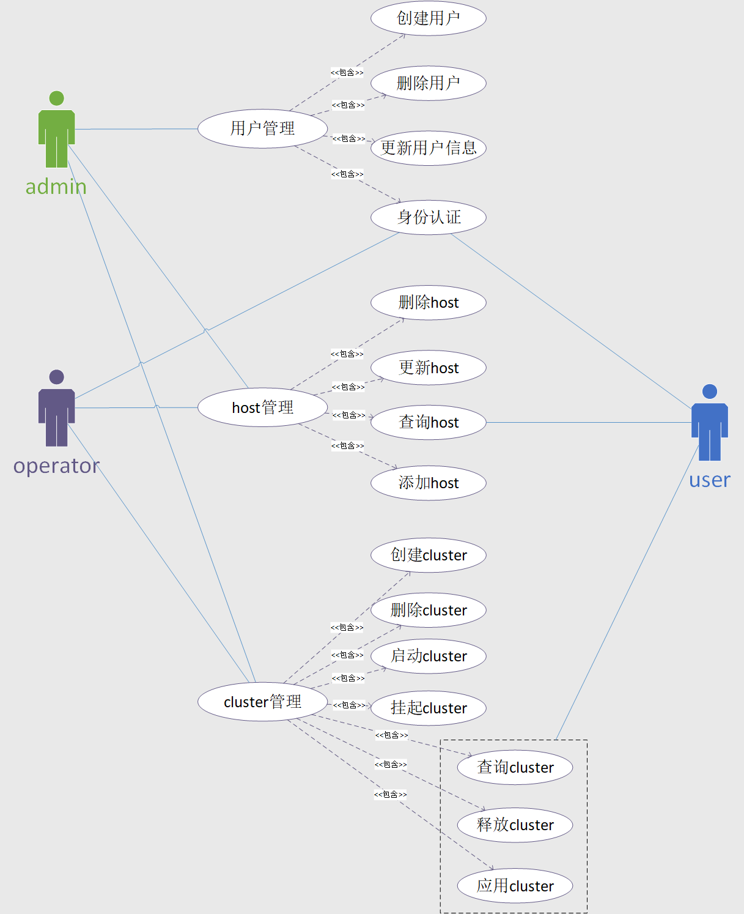
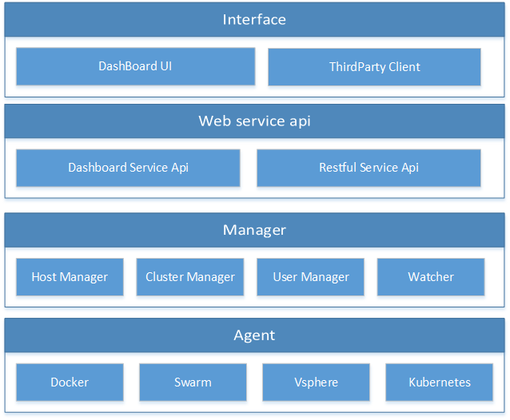
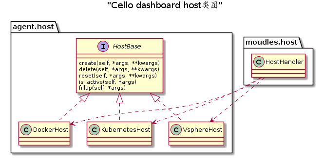
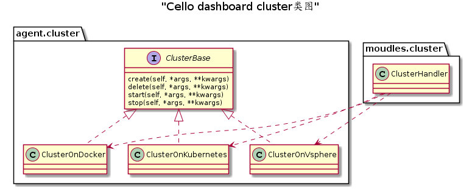
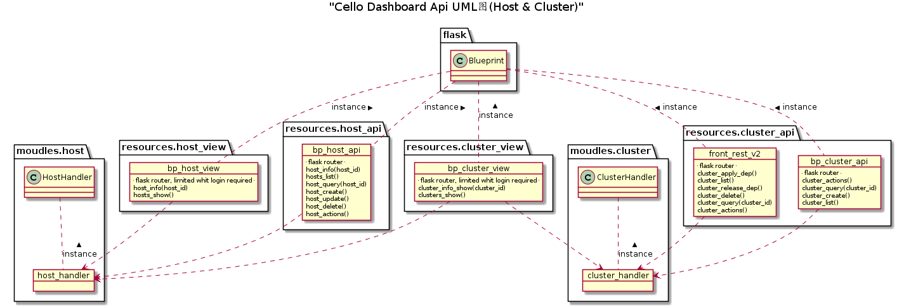
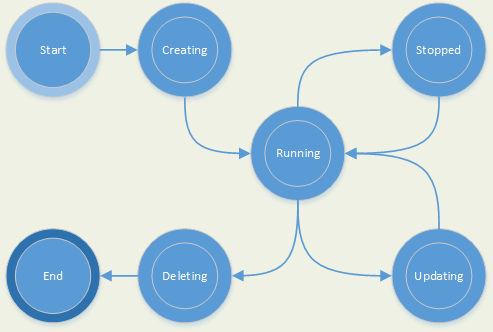

## 关键字

*cluster* : 由多个节点组成的Hyperledger Fabric网络，这里所说的节点是指的fabric节点，它可能运行在云服务器、物理主机或者容器中；

*host* ： 部署cluster的基础设施，一个host中可以运行多个cluster；

*network_type*: fabric网络对应的版本，目前由v1.2.0、v1.1.0和v1.0.5三个类型

*consensus_plugin*: 共识插件，目前有两种共识模式 solo 和 kafka;

*network_config*: fabric 网络的配置，主要用于配置网络application organization的信息（organization的name、domain、peer number）；

*host_capacity* ：一个host中可承载最大cluster数量；

## 工程介绍

&emsp; dashboard是cello项目的一部分，主要的作用有以下三点：

 >   1. 实现整个cello系统的用户管理
 >   2. 对接多种类型的物理层（docker、kubernetes、vsphere、swarm）
 >   3. 部署和管理hyperledger fabric区块链服务，管理整个服务的生命周期


如上图所示，按照角色将用户划分为三类：

+ admin
+ operator
+ user

不同的用户拥有不同的权限(目前尚未实现acl管理)。

&emsp;&emsp;其中Host是指一个可以部署fabric网络的基础设施，它可能是一个安装有docker服务的pc，或是一个swarm集群，或是一个vsphere集群，或是一个kubernetes集群。
&emsp;&emsp;一个cluster就是一个fabric网络，目前有v1.1.0、v1.0.5、v1.2.0三个版本，有kafka和solo两种共识模式，其中包含的组织和组织节点数量由创建时输入的参数决定（目前只有kubernetes支持参数化创建）。

&emsp;&emsp; 目前而言，user、host和cluster三者之间的对应关系如下：

        host ：cluster = 1 ：n
        cluster ：user = 1 ：1  

## 系统架构



&emsp; 如上图所示，dashboard工程大致可以分为四个层次：
&emsp;&emsp; 1. Interface： 负责与用户交互，接收用户的指令。在dashboard中UI是采用**nodeJs + react**框架开发的；
&emsp;&emsp; 2. service api：为interface提供web service api支撑服务，可以供上层调用。其中dashboard service api 主要是给UI调用的，restful service api是给第三方开发者调用的。在dashboard中采用的web框架是**flask**，通信协议是http 1.1；
&emsp;&emsp; 3. manager： 业务逻辑的具体实现，分为主机管理、集群管理、用户管理和状态监听四个部分；
&emsp;&emsp; 4. agent： 负责与“基础设施”打交道，根据用户的请求来安装和部署fabric网络，目前支持Docker、Swarm、Vsphere、Kubernetes四种代理。

&emsp;&emsp;如上所述，dashboard中业务实现大致可以分为三个模块：host、cluster、user，我们主要专注于host和cluster两个模块

## 功能模块

**host模块**

&emsp;&emsp;基类对应的部分在agent.host_base.HostBase 模块中, 继承类在 agent.docker.host.DockerHost、agent.k8s.host.KubernetesHost、agent.vsphere.host.VsphereHost模块中 。

&emsp;&emsp; HostHandler是host的管理类，在dashboard工程中采用单例模式，通过一个hosthandler实例来管理整个服务中的host信息，它在modules.host.HostHandler模块中。

**cluster模块**

&emsp;&emsp;基类对应的部分在 agent.cluster_base.ClusterBase 模块中，继承类在agent.docker.cluster.ClusterOnDocker、agent.k8s.cluster.ClusterOnKubernetes、agent.vsphere.cluster.ClusterOnVsphere 模块中。

&emsp;&emsp;ClusterHandle是cluster的管理类，与HostHandler相同也是采用的单例模式，通过一个clusterhandler实例来管理和操作整个服务的cluster，它在modules.cluster.ClusterHandler中。

**api模块**

&emsp;&emsp;如上图所示，对外提供的api可以划分成host和cluster两类，通过cluster_handler和host_handler对象对cluster和host进行管理。dashboard 的web框架采用的是flask，每个flask.Blueprint的对象都会绑定多个router，维持与api接口映射关系。其中bp_cluster_api、bp_cluster_view、bp_host_view、bp_host_api管理的供前端UI调用的api，front_rest_v2管理的是供第三方调用的api。

## 数据表单结构

&emsp;&emsp;数据库采用的是非关系型数据库mongodb，该数据库采用binary-json格式存储数据，有强大的水平拓展功能，对数据分布式存储支持较好，使用者可以通过类JavaScript的命令来操作数据库。
&emsp;&emsp;在mongodb中最小的数据元是document，每一个collection代表一个document的集合，每一个db中可以包含多个collection，dashboard工程中不同类型的document数据结构如下。

### Cluster Document

```python
class Cluster(Document):
    # cluster的唯一识别符，由程序自动生成的‘十六进制’字符串
    id = StringField(default="", primary_key=True)

    # cluster 的 name 由用户指定
    name = StringField(default="")
    duration = IntField(default=0)

    # cluster 中fabric服务的类型
    network_type = StringField(default="")

    # mapped_ports 物理节点端口和容器端口的映射
    # 在docker类型的cluster中用到
    mapped_ports = DictField(default={})

    # cluster中fabric节点的
    service_url = DictField(default={})

    # fabric 节点的容器
    containers = DictField(default={})

    # fabric 节点的数量
    # 此属性暂时保留，后面会取消
    size = IntField(default=0)

    # 释放的时间
    release_ts = DateTimeField()

    # 当前cluster 状态是否健康
    health = StringField(default="")

    #创建cluster的时间
    create_ts = DateTimeField(default=datetime.datetime.now)

    # 应用cluster的时间
    apply_ts = DateTimeField()

    # 工作节点的api接口
    worker_api = StringField(default="")

    # 当前cluster所处的状态
    status = StringField(default=CLUSTER_STATUS.running.name)

    # 当前cluster情况： active或released
    # 
    state = StringField(default=CLUSTER_STATE.active.name)

    # 所属的host
    host = ReferenceField(Host, default=None)

    # 当前使用此cluster的user id
    user_id = StringField(default="")

    # fabric 网络对外的api 接口，暂时没什么用
    api_url = StringField(default="")

    # 环境变量，是给docker使用的，
    # kubernetes不需要，暂时保留
    env = DictField(default={})

    # fabric 共识插件类型
    consensus_plugin = StringField(default="")

    # cluster端口区间起始地址
    external_port_start = IntField(default=0)

    # 当前network_config的版本
    # 初始化的时候为 0
    version = IntField(default=0)
```

&emsp;&emsp; src.modules.models.host.Cluster定义了cluster document数据格式，示例如下：
cluster_exmaple:

```json
{
    "_id" : "764510fccd1545bd838861dfa0fb9dbe",
    "name" : "first",
    "duration" : 0,
    "network_type" : "fabric-1.2",
    "mapped_ports" : {  },
    "service_url" : {
        "peer1_org2_grpc" : "192.168.1.163:31023",
        "peer0_org1_event" : "192.168.1.163:31028",
        "orderer" : "192.168.1.163:31010",
        "peer0_org2_grpc" : "192.168.1.163:31020",
        "peer0_org1_grpc" : "192.168.1.163:31026",
        "ca_org2_ecap" : "192.168.1.163:31000",
        "peer1_org1_event" : "192.168.1.163:31031",
        "peer0_org2_event" : "192.168.1.163:31022",
        "ca_org1_ecap" : "192.168.1.163:31001",
        "peer1_org1_grpc" : "192.168.1.163:31029",
        "peer1_org2_event" : "192.168.1.163:31025"
        },
    "containers" : {  },
    "size" : 4,
    "health" : "OK",
    "create_ts" : ISODate("2018-10-29T13:44:59.508Z"),
    "worker_api" : "192.168.1.185:6443",
    "status" : "running",
    "state" : "active",
    "host" : "044481524bef46e7b0702eedc070562c",
    "user_id" : "5bd6769007037d3f69575294",
    "api_url" : "",
    "env" : {  },
    "consensus_plugin" : "solo",
    "external_port_start" : 31000,
    "version" : 0,
    "apply_ts" : ISODate("2018-10-29T15:14:01.956Z")
}
```

### service_port

```python
class ServicePort(Document):
    # extarnel port, 可供fabric-sdk访问
    port = IntField(default=0)

    # 物理节点ip， 可以供fabric-sdk访问
    ip = StringField(default="")

    # 地址的名称
    name = StringField(default="")

    # 所属的cluster
    cluster = ReferenceField(Cluster, reverse_delete_rule=CASCADE)
```

&emsp;&emsp; src.modules.models.host.ServicePort定义了service_port document数据格式，如下例所示，每一个service_port document都有对应一个fabric节点供fabric sdk访问的服务地址: peer1_org2_grpc 是peer1_org2节点gossip服务、endorse 服务的地址: 192.168.1.163:31023; peer1_og2_event 是 peer1_org2 节点的event服务地址等等。

service_port example:

```json
{ "_id" : ObjectId("5bd69ead07037d29ce917736"), "port" : 31023, "ip" : "192.168.1.163", "name" : "peer1_org2_grpc", "cluster" : "764510fccd1545bd838861dfa0fb9dbe" }
{ "_id" : ObjectId("5bd69ead07037d29ce917737"), "port" : 31028, "ip" : "192.168.1.163", "name" : "peer0_org1_event", "cluster" : "764510fccd1545bd838861dfa0fb9dbe" }
{ "_id" : ObjectId("5bd69ead07037d29ce917738"), "port" : 31010, "ip" : "192.168.1.163", "name" : "orderer", "cluster" : "764510fccd1545bd838861dfa0fb9dbe" }
{ "_id" : ObjectId("5bd69ead07037d29ce917739"), "port" : 31029, "ip" : 
{ "_id" : ObjectId("5bd69ead07037d29ce91773c"), "port" : 31025, "ip" : "192.168.1.163", "name" : "peer1_org2_event", "cluster" : "764510fccd1545bd838861dfa0fb9dbe" }
{ "_id" : ObjectId("5bd69ead07037d29ce91773d"), "port" : 31022, "ip" : "192.168.1.163", "name" : "peer0_org2_event", "cluster" : "764510fccd1545bd838861dfa0fb9dbe" }
{ "_id" : ObjectId("5bd69ead07037d29ce91773e"), "port" : 31001, "ip" : "192.168.1.163", "name" : "ca_org1_ecap", "cluster" : "764510fccd1545bd838861dfa0fb9dbe" }
```

### container

```python
class Container(Document):
    # container 的 id，由底层服务自动分配
    id = StringField(default="", primary_key=True)

    # container的名称
    name = StringField(default="")

    # 所属的cluster
    cluster = ReferenceField(Cluster, reverse_delete_rule=CASCADE)
```

&emsp;&emsp; src.modules.models.host.Container 定义了 container document的数据结构，在目前而言，docker或k8s的host中每一个节点都是运行在一个容器中，相比较 虚拟机环境 而言它的开销更小，相较于local环境 而言，它管理更方便。

container example:

```json
{ "_id" : "f34826ad-db3d-11e8-948d-1c1b0d52b14c", "name" : "cli-ordererorg-6f86cf44bb-rpt4q", "cluster" : "764510fccd1545bd838861dfa0fb9dbe" }
{ "_id" : "dce262c4-db3d-11e8-948d-1c1b0d52b14c", "name" : "ca-org1-7995bccc97-vdg5f", "cluster" : "764510fccd1545bd838861dfa0fb9dbe" }
{ "_id" : "e482fb6a-db3d-11e8-948d-1c1b0d52b14c", "name" : "peer1-org1-cc4648ffd-rc5p8", "cluster" : "764510fccd1545bd838861dfa0fb9dbe" }
```

### deployment

```python
class Deployment(Document):
    # 唯一识别符，目前是一个‘十六进制’的字符串
    id = StringField(default="", primary_key=True)

    # 类型， kubernetes中的属性之一，
    # 可能为：Namespace、PersistentVolume、
    # PersistentVolumeClaim、Service、Deployment
    kind = StringField(default="")

    # 名称
    name = StringField(default="")

    # 详细配置数据
    data = DictField(default={})

    # 所属的cluster
    cluster = ReferenceField(Cluster, reverse_delete_rule=CASCADE)
```

&emsp;&emsp; src.modules.models.host.Deployment 定义了 deployment document的数据结构， 这是部署在kubernetes类型host上的cluster特有的一中数据，它记录了cluster在kubernetes集群中的配置，可以利用这些配置数据来 删除、创建在 kubernetes中的资源，如删除一个或多个节点，删除持久卷等等。如下例所示：这是一个名为 first 的 namespace的配置数据，可以利用它先 kubernetes 发起创建或者删除namespace的请求。

deployment example:

```json
{ 
    "_id" : "c2fb87ce905f47aab8c55e654fde1b80",
    "kind" : "Namespace",
    "name" : "first",
    "data" : {
        "metadata" : {
            "name" : "first" 
            }, 
        "apiVersion" : "v1", 
        "kind" : "Namespace" 
    }, 
    "cluster" : "764510fccd1545bd838861dfa0fb9dbe" 
}

{ 
    "_id" : "9cd6b32e436f4c42b7359c63339a830c", 
    "kind" : "PersistentVolume", 
    "name" : "first-org2-pv", 
    "data" : { 
        "metadata" : { 
            "name" : "first-org2-pv" 
        }, 
    "spec" : { 
        "claimRef" : { "namespace" : "first", "name" : "first-org2-pvc" }, "nfs" : { "server" : "172.168.170.201", "path" : "/first/crypto-config/peerOrganizations/org2.example.com" }, "capacity" : { "storage" : "500Mi" }, "accessModes" : [ "ReadWriteMany" ] }, "kind" : "PersistentVolume", "apiVersion" : "v1" 
    }, 
    "cluster" : "764510fccd1545bd838861dfa0fb9dbe" 
}
```

### cluster_network

```python
class ClusterNetwork(Document):
    # 所属的cluster
    cluster = ReferenceField(Cluster, reverse_delete_rule=CASCADE)
    # cluster的network_config 数据
    network = DictField(default={})
    # network_config 版本
    version = IntField(default=0)
```

&emsp;&emsp; src.modules.models.host.Deployment 定义了 cluster_network document 数据结构， 它其中包含了一个cluster的network_config 数据， 由于cluster会有更新的情况发生，所以通过version来标识每一个network的先后顺序，而cluster.version 对应的 cluster_network 就是当前cluster的 network_config。
&emsp;&emsp; 如下例所示：它记录了 cluster.id == *764510fccd1545bd838861dfa0fb9dbe*的 cluster的  0 版本 network_config，即初始配置。在初始配置中，cluster的fabric 网络中包含了 两个 Application 组织: Org1、Org2，每一个组织中包含了两个peer 节点，Orderer组织中只有一个 orderer节点，因为它是 solo 共识。

cluster_network example

```json
{
    "_id" : ObjectId("5bd69ead07037d29ce917741"),
    "cluster" : "764510fccd1545bd838861dfa0fb9dbe",
    "network" : {
        "application" : [
            {
                "org_name" : "Org2",
                "peers" : [ "peer0", "peer1" ],
                "anchor_peer" : "peer0",
                "domain" : "org2.example.com"
            },
            {
                "org_name" : "Org1",
                "peers" : [ "peer0", "peer1" ],
                "anchor_peer" : "peer0",
                "domain" : "org1.example.com"
            }
        ],
        "orderer" : {
            "org_name" : "OrdererOrg",
            "peers" : [ "orderer0" ],
            "anchor_peer" : "",
            "domain" : "orderer.example.com"
        },
        "consensus" : "solo",
        "version" : "fabric-1.2"
    },
    "version" : 0
}
```

### host

```python
class Host(Document):
    # host id ，唯一识别符， “十六进制”字符串
    id = StringField(default="", primary_key=True)

    # host 名称
    name = StringField(default="")

    # host 中工作节点的 api 接口地址
    # 在kubernetes中就是 master节点的 resetful api地址
    worker_api = StringField(default="")

    # host 创建的时间
    create_ts = DateTimeField(default=datetime.datetime.now)

    # host 当前的状态，默认为 active
    status = StringField(default="active")

    # host 的类型
    # docker、swarm、kubernetes、vsphere
    type = StringField(default="")

    # host日志等级， 默认文 info
    log_level = StringField(default=LOG_LEVEL.INFO.name)

    # host 日志的type
    log_type = StringField(default="")

    # log 服务器的地址
    # 目前没有实现
    log_server = StringField(default="")

    # 是否支持自动填充cluster到host， 默认为否
    autofill = BooleanField(default=False)

    # 是否支持用户在该host的cluster上配置计划
    # 默认为否，目前没有实现
    schedulable = BooleanField(default=False)

    # host中最大容纳cluster的数量
    capacity = IntField(default=0)

    # 当前在host中部署的cluster id
    clusters = ListField(default=[])

    # vsphere 的token，用于链接vsphere
    vcparam = DictField(default={})

    # k8s 的token， 用于链接 k8s
    k8s_param = DictField(default={})
```

&emsp;&emsp; src.modules.models.host.Deployment 定义了 host document 数据结构，上面已经对host做过介绍，这里就不再重复叙述了。如下例所示：这是一个k8s类型的 cluster, k8s的 master node api 地址为 *192.168.1.185:6443* ， capacity为 1 即最多只能创建一个cluster，日志等级为 DEBUG，日志类型为local。

host_example

```json
{
    "_id" : "044481524bef46e7b0702eedc070562c",
    "name" : "test",
    "worker_api" : "192.168.1.185:6443",
    "create_ts" : ISODate("2018-10-29T10:28:34.469Z"),
    "status" : "active",
    "type" : "kubernetes",
    "log_level" : "DEBUG",
    "log_type" : "local",
    "log_server" : "",
    "autofill" : false,
    "schedulable" : false,
    "capacity" : 1,
    "clusters" : [ "764510fccd1545bd838861dfa0fb9dbe" ],
    "vcparam" : {  },
    "k8s_param" : {
        "K8SNfsServer" : "172.168.170.201",
        "K8SSslCert" : null,
        "K8SCredType" : "2",
        "LoggingType" : "local",
        "K8SConfig" : "... ...",
        "K8SUseSsl" : "false",
        "Capacity" : 5,
        "Name" : "test",
        "K8SAddress" : "192.168.1.185:6443"
    }
}
```

## cluster 管理

&emsp;&emsp; 一个cluster会可能处于 CREATING、RUNNING、STOPPED、DELETING、UPDATING 五种状态，cluster会在这五中状态之间切换：


        + CREATING: cluster中的fabric 服务正在创建中
        + RUNNING: cluster中的fabric 服务处于运行状态
        + STOPPED: cluster中的fabric 服务已经被挂起
        + DELETING: cluster中的fabric 服务正在删除
        + UPDATING: cluster中的fabric 服务正在更新

&emsp;&emsp; 只有cluster处于RUNNING的状态时，fabric 服务才是可用状态，其他状态都不可用。
&emsp;&emsp; 下面以k8s类型的cluster创建为例，阐述一个fabric network服务创建的流程。

```flow

```

准备阶段：

&emsp;&emsp;**setup 0**： 添加一个host，对于k8s而言就是添加一个 k8s 集群，用户需要将 k8s 的admin token（k8s token 有user-passwd、config file和certificates三种形式） 上传到cello服务。cello服务 尝试与集群链接校验配置是否正确。配置nfs服务器，用于创建pv，存储fabric节点所需要的配置文件。同时还要指定host_capacity。

&emsp;&emsp;**setup 1**: 指定创建cluster的host，配置cluster的参数，包括 network_type、network_config、consensus_plugin、cluster_name等

&emsp;&emsp;**setup 2**：判断当前host_capacity是否满足，如果容量不充足则停止创建。查询当前host中的端口资源是否充足，为cluster分配端口区间，如果端口资源不足则停止创建（详细请见下节中的端口资源分配方案）。

&emsp;&emsp;**setup3**:  将cluster信息写入数据库，设置为CREATING状态，开启创建cluster任务。

创建阶段：
&emsp;&emsp;**setup4**: 通过http请求调用 crypto-url服务（可以根据network_config 参数 来生成fabric 网络所需的配置文件）来生成fabric 网络的配置文件，并复制到 nfs 网络文件夹下。

&emsp;&emsp;**setup5**: 通过 k8s sdk 向host对应的k8s集群发送创建fabric 服务的指令，主要是创建各个节点，同时为每个组织创建pv（永久存储， 组织节点通过pv将 fabric网络 配置文件（msp、genesis.block、createchannel.tx等）挂载到容器中。）。

&emsp;&emsp;**setup6**: 检查fabric 服务是否创建完成（即检查各个节点是否启动成功），如果创建失败则delete cluster。

结束阶段：
&emsp;&emsp;**setup7**: 将cluster中fabric 网络节点的地址、节点对应的容器id写入数据库，同时将cluster 设置为 RUNNING状态。

## cluster 端口分配方案(Kubernetes)

&emsp;&emsp;每一个cluster 分配一个external_start_port, 总计端口区间为 [ external_start_port , external_start_port + 100) (暂定每个cluster 100个端口)，区间内的端口可供cluster内的节点所使用，其中：

+ [external_start_port, external_start_port + 10) 端口是分配给 CA节点的;
+ [external_start_port + 10, external_start_port + 20) 是分配给Orderer节点的;
+ [external_start_port + 20, external_start_port + 100)分配给peer节点;

&emsp;&emsp;目前来看 CA 节点和 Orderer 节点只占用一个external端口，而peer节点需要占用三个external端口。也就是说一个fabric网络中最多可以有10个 CA 节点和10个 Orderer 节点，目前一个组织对应一个CA，因此一个fabric 网络最多可以包含10个组织，而总计的 peer 节点最多为26个。
&emsp;&emsp;每一个kubernetes集群中总的端口取值区间为[31000,32000]，也就是说目前一个kubernetes集群在资源充足的情况下，最多可部署10个cluster。

## 参考网址

1. cello 项目介绍：
https://cello.readthedocs.io/en/latest/

2. 项目地址：
https://github.com/luckydogchina/cello.git
ps: 原始的cello项目在master分支，我们的项目在lyra分支

3. cello 社区地址：
https://chat.hyperledger.org/channel/cello